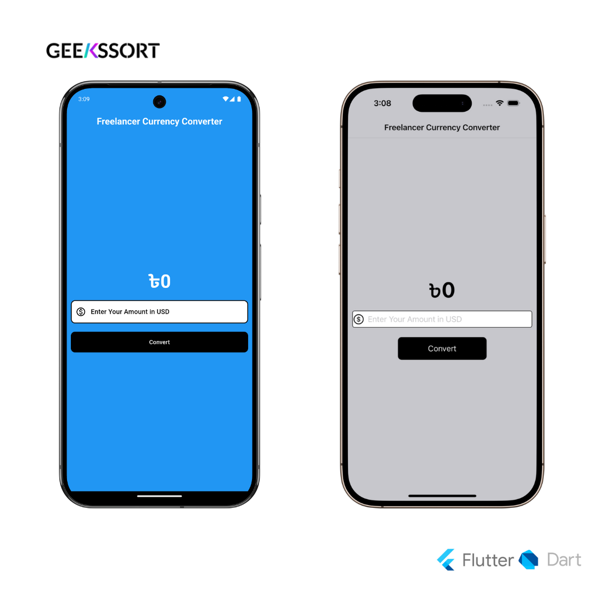

# 💱 Currency Converter App

A simple Flutter application that converts USD (United States Dollar) to BDT (Bangladeshi Taka). This app provides a clean and user-friendly interface for quick currency conversion. 💫

## ✨ Features

- 💵 Convert USD to BDT in real-time
- 🎯 Clean and intuitive user interface
- ✅ Input validation for numbers
- 📊 Displays result with proper formatting

## 📱 Screenshots



## 🚀 Getting Started

### 📋 Prerequisites

- 📦 Flutter SDK (2.0 or higher)
- 🎯 Dart SDK (2.12 or higher)
- 💻 Android Studio or VS Code with Flutter extensions

### ⚙️ Installation

1. Clone this repository:
```bash
git clone https://github.com/siraajul/currency_converter.git
```

2. Navigate to the project directory:
```bash
cd currency_converter
```

3. Install dependencies:
```bash
flutter pub get
```

4. Run the app:
```bash
flutter run
```

## 📖 How to Use

1. 📱 Launch the app
2. 💲 Enter the amount in USD in the input field
3. 🔄 Press the "Convert" button
4. 👀 View the converted amount in BDT

## 🔮 Future Updates

- 🌐 Support for more currencies
- 📊 Live exchange rate updates
- 📝 Currency conversion history
- 🔌 Offline support
- 🎨 Theme customization

## 🤝 Contributing

Contributions are welcome! Please feel free to submit a Pull Request. ⭐

## 📄 License

This project is licensed under the MIT License - see the [LICENSE](LICENSE) file for details. 📜